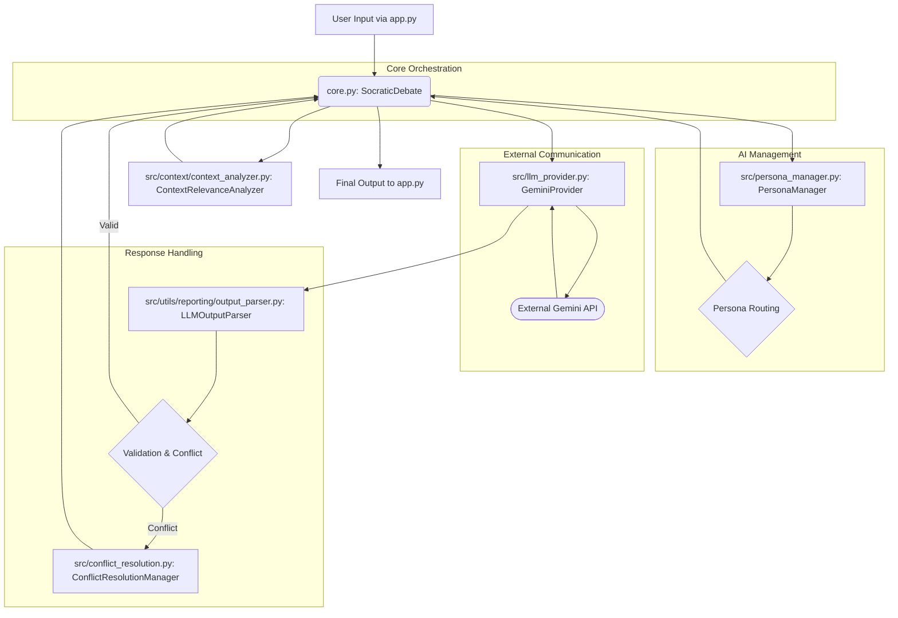

# Project Chimera System Architecture

This document provides a high-level overview of the Project Chimera system architecture, detailing the interactions between its core components.

## Architectural Diagram

## Component Descriptions & Flow

1.  **User Input (`app.py`):** The user provides a prompt and optional codebase context through the Streamlit UI.
2.  **SocraticDebate (`core.py`):** This is the central orchestrator. It initializes all necessary components for the debate, manages the turns, and integrates outputs.
3.  **PersonaManager (`src/persona_manager.py`):** Manages all persona configurations, sets, and performance metrics. It uses the `PersonaRouter` to determine the sequence of specialized AI personas for the debate.
4.  **ContextRelevanceAnalyzer (`src/context/context_analyzer.py`):** Scans the provided codebase, computes semantic embeddings, and identifies the most relevant files and content for the given prompt. This context is used to inform the debate.
5.  **Debate Loop (`core.py`):** The `SocraticDebate` instance iterates through the dynamically determined persona sequence. In each turn, it prepares a prompt (incorporating debate history and relevant context) and calls the `GeminiProvider`.
6.  **GeminiProvider (`src/llm_provider.py`):** This module is responsible for all communication with the external Google Gemini API. It handles API key management, retries, rate limiting, and circuit breaker logic for resilient interaction.
7.  **LLMOutputParser (`src/utils/reporting/output_parser.py`):** The raw response from the LLM is passed to this parser, which extracts the JSON content, applies repair heuristics, and validates it against the persona's expected Pydantic schema.
8.  **ConflictResolutionManager (`src/conflict_resolution.py`):** If the output is malformed, misaligned, or a persona reports a conflict, this manager is invoked to attempt automated resolution, such as synthesizing a response from previous valid turns or retrying the persona with specific feedback.
9.  **Final Synthesis:** After all debate turns are completed (or a resolution is reached), a final synthesis persona (e.g., `Impartial_Arbitrator` or `Self_Improvement_Analyst`) is called to consolidate the debate's findings and generate the final answer.
10. **Output to UI (`app.py`):** The final, structured answer is returned to the Streamlit UI for display, along with intermediate steps and a process log.